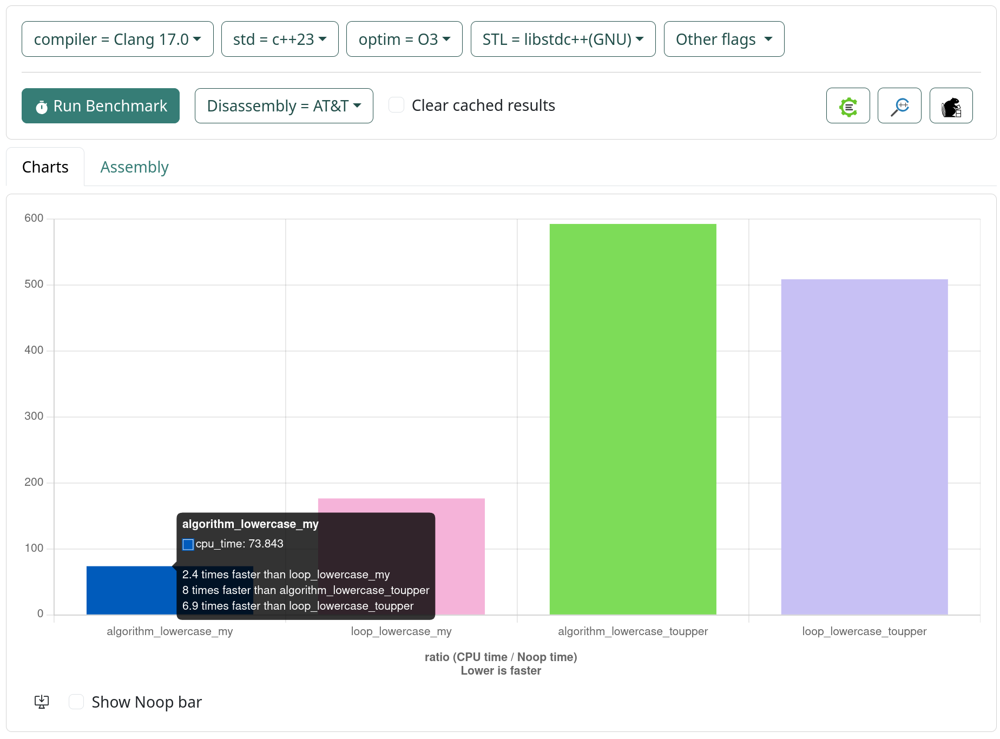

# bench


Various C++ benchmarks:

- transform.cpp - benchmark std::transform vs loop and custom lowercase and tolower

---
```shell
    $ make releasec # clang++ 21.1.8
    $ ./build/releasec/transform
```

            2026-02-07T15:43:00+02:00
            Running ./build/releasec/transform
            Run on (32 X 5187.5 MHz CPU s)
            CPU Caches:
              L1 Data 48 KiB (x16)
              L1 Instruction 32 KiB (x16)
              L2 Unified 1024 KiB (x16)
              L3 Unified 32768 KiB (x2)
            Load Average: 0.58, 0.53, 0.60
            ***WARNING*** CPU scaling is enabled, the benchmark real time measurements may be noisy and will incur extra overhead.
            ***WARNING*** ASLR is enabled, the results may have unreproducible noise in them.
            ----------------------------------------------------------------------
            Benchmark                            Time             CPU   Iterations
            ----------------------------------------------------------------------
            algorithm_lowercase_my            17.8 ns         17.7 ns     39664595
            loop_lowercase_my                 31.9 ns         31.9 ns     22028280
            algorithm_lowercase_toupper       79.3 ns         79.2 ns      8838048
            loop_lowercase_toupper            69.7 ns         69.5 ns      9977740
---
```shell
    $ make release # g++ 15.2.1
    $ ./build/release/transform 
```

            2026-02-07T15:43:03+02:00
            Running ./build/release/transform
            Run on (32 X 5187.5 MHz CPU s)
            CPU Caches:
              L1 Data 48 KiB (x16)
              L1 Instruction 32 KiB (x16)
              L2 Unified 1024 KiB (x16)
              L3 Unified 32768 KiB (x2)
            Load Average: 0.61, 0.54, 0.60
            ***WARNING*** CPU scaling is enabled, the benchmark real time measurements may be noisy and will incur extra overhead.
            ***WARNING*** ASLR is enabled, the results may have unreproducible noise in them.
            ----------------------------------------------------------------------
            Benchmark                            Time             CPU   Iterations
            ----------------------------------------------------------------------
            algorithm_lowercase_my            17.7 ns         17.7 ns     33607332
            loop_lowercase_my                 28.2 ns         28.2 ns     24781013
            algorithm_lowercase_toupper       77.1 ns         77.0 ns      9116098
            loop_lowercase_toupper            65.5 ns         65.4 ns     10687636
---




---
